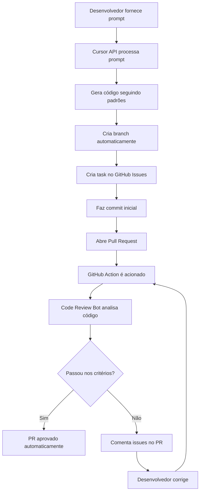

# Definição do Projeto - Módulo de Automação de Desenvolvimento

## Visão Geral

Este projeto é um **módulo integrável** que pode ser incluído em qualquer pipeline de CI/CD ou workflow de desenvolvimento. O módulo automatiza o processo de desenvolvimento onde um prompt fornecido à API do Cursor gera automaticamente uma branch, cria uma task, abre um Pull Request e executa um code review automatizado, aplicando práticas de SOLID, Design Patterns (Atomic Design) e Lint.

**Características Principais:**

- 📦 **Pacote NPM** - Instalável como dependência em qualquer projeto
- 🔌 **API Simples** - Interface clara e fácil de integrar
- ⚙️ **Configurável** - Adaptável a diferentes pipelines e workflows
- 🔄 **Reutilizável** - Pode ser usado em múltiplos projetos
- 🚀 **Plug & Play** - Integração rápida em pipelines existentes

## Objetivos

1. **Modularidade**: Criar um módulo reutilizável que possa ser integrado em qualquer pipeline
2. **Automação do Fluxo de Desenvolvimento**: Reduzir o tempo entre a concepção de uma feature e sua revisão
3. **Garantia de Qualidade**: Assegurar que todo código siga padrões definidos (SOLID, Design Patterns, Lint)
4. **Integração Simples**: Oferecer uma API simples e clara para integração em pipelines existentes
5. **Flexibilidade**: Permitir configuração e customização para diferentes projetos e necessidades

## Arquitetura do Módulo

### Estrutura como Pacote

O módulo será distribuído como um pacote NPM com a seguinte estrutura:

```
@arranjae/automate-features
├── lib/              # Código compilado
├── src/              # Código fonte
├── types/            # Definições TypeScript
├── config/           # Configurações padrão
└── dist/             # Build de distribuição
```

### API Principal

O módulo exporta uma interface principal que pode ser usada em qualquer pipeline:

```typescript
// Exemplo de uso básico
import { CodeGenerator, CodeReviewer, Pipeline } from '@arranjae/automate-features';

const pipeline = new Pipeline({
  cursorApiToken: process.env.CURSOR_API_TOKEN,
  githubToken: process.env.GITHUB_TOKEN,
  config: {
    solidRules: true,
    atomicDesign: true,
    lintRules: ['eslint', 'prettier'],
  },
});

// Processar prompt e gerar código
const result = await pipeline.process({
  prompt: 'Criar componente de autenticação',
  options: {
    createBranch: true,
    createIssue: true,
    createPR: true,
    runCodeReview: true,
  },
});
```

### Componentes Principais

#### 1. Cursor API Interface

- **Função**: Receber prompts do desenvolvedor
- **Entrada**: Descrição da feature/task em linguagem natural
- **Saída**: Código estruturado seguindo padrões definidos
- **Tecnologia**: Integração com Cursor API

#### 2. Branch Generator

- **Função**: Criar branch automaticamente baseada no prompt
- **Estratégia de Nomenclatura**:
  - Formato: `feature/[issue-number]-[kebab-case-description]`
  - Exemplo: `feature/123-user-authentication-flow`

#### 3. Task Creator

- **Função**: Criar issue/task no sistema de gerenciamento de projetos
- **Integração**: GitHub Issues ou Jira/Linear
- **Conteúdo Gerado**:
  - Título da task
  - Descrição detalhada
  - Critérios de aceitação
  - Labels apropriados

#### 4. Pull Request Generator

- **Função**: Criar PR automaticamente após commit inicial
- **Template**: PR template padronizado
- **Conteúdo**:
  - Descrição da mudança
  - Checklist de validação
  - Links para issues relacionadas

#### 5. GitHub Actions - Code Review Bot

- **Função**: Executar code review automatizado
- **Checkpoints**:
  - **SOLID Principles**:
    - Single Responsibility Principle (SRP)
    - Open/Closed Principle (OCP)
    - Liskov Substitution Principle (LSP)
    - Interface Segregation Principle (ISP)
    - Dependency Inversion Principle (DIP)
  - **Design Patterns (Atomic Design)**:
    - Estrutura de componentes (Atoms → Molecules → Organisms → Templates → Pages)
    - Padrões de projeto (Factory, Observer, Strategy, etc.)
  - **Lint**:
    - Análise estática de código
    - Formatação consistente
    - Detecção de code smells

## Fluxo de Trabalho



## Especificações Técnicas

### Padrões de Código

#### SOLID Principles

1. **Single Responsibility Principle (SRP)**
   - Cada classe/função deve ter apenas uma razão para mudar
   - Validação: Verificar se classes têm responsabilidades bem definidas

2. **Open/Closed Principle (OCP)**
   - Entidades devem estar abertas para extensão, fechadas para modificação
   - Validação: Verificar uso de interfaces e herança apropriada

3. **Liskov Substitution Principle (LSP)**
   - Objetos derivados devem ser substituíveis por seus tipos base
   - Validação: Verificar que implementações não quebram contratos

4. **Interface Segregation Principle (ISP)**
   - Clientes não devem depender de interfaces que não usam
   - Validação: Verificar que interfaces são específicas e coesas

5. **Dependency Inversion Principle (DIP)**
   - Depender de abstrações, não de concretizações
   - Validação: Verificar uso de dependency injection e inversão de controle

#### Atomic Design Pattern

A estrutura de componentes deve seguir a hierarquia:

```
atoms/
  ├── Button
  ├── Input
  └── Label
molecules/
  ├── SearchBar (Input + Button)
  └── FormField (Label + Input)
organisms/
  ├── Header (múltiplas molecules)
  └── ProductCard (múltiplas molecules)
templates/
  ├── PageTemplate
  └── LayoutTemplate
pages/
  ├── HomePage
  └── ProductPage
```

**Validação**:

- Verificar se componentes seguem a hierarquia apropriada
- Atoms não devem importar Molecules/Organisms
- Organisms podem usar Molecules e Atoms

#### Lint Rules

- **ESLint** (para JavaScript/TypeScript) ou equivalente
- Regras específicas:
  - Prefer const/let sobre var
  - Naming conventions (camelCase para variáveis, PascalCase para classes)
  - Max complexity de funções
  - Proibição de console.log em produção
  - Detecção de código morto

## Estrutura de Arquivos do Módulo

```
.
├── src/
│   ├── index.ts                 # Entry point principal - exports da API
│   ├── core/
│   │   ├── Pipeline.ts          # Classe principal do pipeline
│   │   ├── CodeGenerator.ts     # Geração de código via Cursor API
│   │   └── CodeReviewer.ts      # Code review automatizado
│   ├── generators/
│   │   ├── BranchGenerator.ts   # Geração de branches
│   │   ├── TaskCreator.ts       # Criação de tasks/issues
│   │   └── PRGenerator.ts       # Criação de Pull Requests
│   ├── validators/
│   │   ├── SolidValidator.ts    # Validação de princípios SOLID
│   │   ├── AtomicDesignValidator.ts  # Validação de Atomic Design
│   │   └── LintValidator.ts     # Validação de Lint
│   ├── integrations/
│   │   ├── CursorAPI.ts         # Integração com Cursor API
│   │   ├── GitHubAPI.ts         # Integração com GitHub API
│   │   └── GitAPI.ts            # Operações Git
│   └── types/
│       └── index.ts             # Definições TypeScript
├── config/
│   ├── eslint.config.js         # Configuração ESLint padrão
│   ├── solid-rules.json         # Regras de validação SOLID
│   ├── atomic-design-rules.json # Regras de validação Atomic Design
│   └── default-config.json      # Configurações padrão
├── lib/                          # Código compilado (gerado)
├── dist/                         # Build de distribuição (gerado)
├── examples/                     # Exemplos de uso
│   ├── github-actions/          # Exemplo de uso em GitHub Actions
│   ├── jenkins/                 # Exemplo de uso em Jenkins
│   ├── gitlab-ci/               # Exemplo de uso em GitLab CI
│   └── custom-pipeline/         # Exemplo de pipeline customizado
├── tests/                        # Testes
├── docs/
│   ├── API.md                   # Documentação da API
│   ├── INTEGRATION.md           # Guia de integração
│   ├── SOLID.md                 # Documentação sobre SOLID
│   ├── ATOMIC_DESIGN.md         # Documentação sobre Atomic Design
│   └── CONTRIBUTING.md          # Guia de contribuição
├── .github/
│   └── workflows/
│       ├── ci.yml               # CI do próprio módulo
│       └── publish.yml          # Publicação do pacote
├── package.json                 # Configuração do pacote NPM
├── tsconfig.json                # Configuração TypeScript
├── .env                         # Variáveis de ambiente (não versionado)
├── .env.example                 # Template de variáveis de ambiente
├── .gitignore                   # Arquivos ignorados pelo Git
└── PROJECT.md                   # Este arquivo
```

## Integração em Pipelines

### Exemplo 1: GitHub Actions

```yaml
name: Automated Code Review

on:
  pull_request:
    types: [opened, synchronize, reopened]

jobs:
  code-review:
    runs-on: ubuntu-latest
    steps:
      - uses: actions/checkout@v3

      - name: Setup Node.js
        uses: actions/setup-node@v3

      - name: Install @arranjae/automate-features
        run: npm install @arranjae/automate-features

      - name: Run Code Review
        uses: ./.github/actions/code-review
        env:
          CURSOR_API_TOKEN: ${{ secrets.CURSOR_API_TOKEN }}
          GITHUB_TOKEN: ${{ secrets.GITHUB_TOKEN }}
```

### Exemplo 2: Jenkins Pipeline

```groovy
pipeline {
    agent any
    environment {
        CURSOR_API_TOKEN = credentials('cursor-api-token')
        GITHUB_TOKEN = credentials('github-token')
    }
    stages {
        stage('Code Review') {
            steps {
                sh 'npm install @arranjae/automate-features'
                sh 'npx automate-features review --pr ${PR_NUMBER}'
            }
        }
    }
}
```

### Exemplo 3: GitLab CI

```yaml
code-review:
  image: node:18
  script:
    - npm install @arranjae/automate-features
    - npx automate-features review
  variables:
    CURSOR_API_TOKEN: $CURSOR_API_TOKEN
    GITHUB_TOKEN: $GITHUB_TOKEN
```

### Exemplo 4: CLI Standalone

```bash
# Instalação global
npm install -g @arranjae/automate-features

# Uso básico
automate-features generate \
  --prompt "Criar componente de autenticação" \
  --create-branch \
  --create-pr \
  --review

# Uso em script Node.js
node -e "
const { Pipeline } = require('@arranjae/automate-features');
const pipeline = new Pipeline({
  cursorApiToken: process.env.CURSOR_API_TOKEN
});
pipeline.process({ prompt: 'Criar feature X' });
"
```

## Critérios de Aceitação

### Para o Módulo

- [ ] Módulo pode ser instalado via NPM (`npm install @arranjae/automate-features`)
- [ ] API principal exporta classes e funções principais
- [ ] Módulo é compatível com TypeScript (inclui types)
- [ ] Documentação completa da API disponível
- [ ] Exemplos de integração para principais pipelines (GitHub Actions, Jenkins, GitLab CI)
- [ ] CLI funcional para uso standalone

### Para o Sistema Completo

- [ ] Desenvolvedor pode fornecer um prompt em linguagem natural
- [ ] Sistema gera código automaticamente seguindo padrões
- [ ] Branch é criada automaticamente com nomenclatura padronizada
- [ ] Task é criada no GitHub Issues automaticamente
- [ ] Pull Request é aberto automaticamente
- [ ] Code review executa automaticamente via módulo
- [ ] Code review verifica SOLID principles
- [ ] Code review verifica Atomic Design structure
- [ ] Code review executa Lint
- [ ] Comentários são adicionados ao PR com feedback detalhado
- [ ] PR pode ser aprovado automaticamente se passar em todos os critérios
- [ ] Módulo pode ser integrado em pipelines existentes sem breaking changes

## Configuração de Ambiente

### Variáveis de Ambiente

O projeto utiliza um arquivo `.env` para configurar tokens e credenciais necessárias. Crie um arquivo `.env` na raiz do projeto baseado no `.env.example`:

```bash
# Cursor API Configuration
CURSOR_API_TOKEN=your_cursor_api_token_here

# GitHub Configuration (opcional - para automação completa)
GITHUB_TOKEN=your_github_token_here
GITHUB_REPO_OWNER=your_username_or_org
GITHUB_REPO_NAME=your_repo_name

# Node Environment
NODE_ENV=development
```

### Como Obter as Credenciais

#### Cursor API Token

1. Acesse as configurações do Cursor: `https://cursor.sh/settings` ou através do menu do Cursor
2. Navegue até a seção de API/Integrations
3. Gere um novo token ou copie o token existente
4. Cole o token no arquivo `.env` como `CURSOR_API_TOKEN`

#### GitHub Token

1. Acesse: `https://github.com/settings/tokens`
2. Clique em "Generate new token" → "Generate new token (classic)"
3. Selecione as permissões necessárias:
   - `repo` (acesso completo a repositórios privados)
   - `workflow` (atualizar GitHub Actions)
   - `write:issues` (criar e editar issues)
   - `pull_requests:write` (criar e editar PRs)
4. Gere e copie o token para o arquivo `.env`

**Importante**: Nunca commite o arquivo `.env` no repositório. O `.gitignore` já está configurado para ignorá-lo.

## Tecnologias e Ferramentas

### Core

- **TypeScript**: Linguagem principal do módulo
- **Node.js**: Runtime necessário
- **NPM**: Gerenciamento de pacotes e publicação

### APIs e Integrações

- **Cursor API**: Integração com Cursor API para geração de código
- **GitHub API**: Para criação de branches, issues e PRs
- **Git API**: Para operações de Git (usando `simple-git` ou similar)

### Validação e Análise

- **ESLint/TSLint**: Para análise estática de código
- **AST Parsers**: Para análise de estrutura de código (esprima, babel-parser)
- **Custom Validators**: Para validação de SOLID e Atomic Design

### Build e Distribuição

- **TypeScript Compiler**: Compilação do código
- **Rollup/Webpack**: Bundle para distribuição
- **Jest/Vitest**: Framework de testes

### Pipelines Suportados

- GitHub Actions
- Jenkins
- GitLab CI/CD
- CircleCI
- Azure DevOps
- Custom pipelines via CLI

## Próximos Passos

### Fase 1: Estrutura Base do Módulo

1. Criar estrutura inicial do projeto NPM
2. Configurar TypeScript e build system
3. Criar `package.json` com metadados e exports
4. Configurar sistema de build e distribuição

### Fase 2: Core do Módulo

5. Implementar classe principal `Pipeline`
6. Criar integração com Cursor API
7. Implementar geradores (Branch, Task, PR)
8. Criar sistema de configuração

### Fase 3: Validadores

9. Implementar validadores de SOLID
10. Implementar validadores de Atomic Design
11. Implementar validador de Lint
12. Criar sistema de relatórios

### Fase 4: CLI e Exemplos

13. Criar CLI standalone
14. Criar exemplos de integração (GitHub Actions, Jenkins, GitLab CI)
15. Documentar API completa
16. Criar guias de integração

### Fase 5: Testes e Publicação

17. Escrever testes unitários e de integração
18. Testar em diferentes pipelines
19. Publicar pacote no NPM
20. Criar documentação final

## API do Módulo

### Classes Principais

```typescript
// Classe principal do pipeline
class Pipeline {
  constructor(config: PipelineConfig);
  async process(options: ProcessOptions): Promise<ProcessResult>;
  async review(prNumber: number): Promise<ReviewResult>;
}

// Gerador de código
class CodeGenerator {
  async generate(prompt: string, config?: GeneratorConfig): Promise<GeneratedCode>;
}

// Revisor de código
class CodeReviewer {
  async review(code: string, config?: ReviewConfig): Promise<ReviewReport>;
}
```

### Interfaces

```typescript
interface PipelineConfig {
  cursorApiToken: string;
  githubToken?: string;
  config?: {
    solidRules?: boolean;
    atomicDesign?: boolean;
    lintRules?: string[];
    autoApprove?: boolean;
  };
}

interface ProcessOptions {
  prompt: string;
  createBranch?: boolean;
  createIssue?: boolean;
  createPR?: boolean;
  runCodeReview?: boolean;
}
```

## Notas Adicionais

### Design do Módulo

- **Modularidade**: Cada componente pode ser usado independentemente
- **Extensibilidade**: Sistema de plugins para adicionar novos validadores
- **Configurabilidade**: Todas as regras podem ser customizadas
- **TypeScript First**: Tipos completos para melhor DX

### Requisitos

- Node.js >= 16.0.0
- Compatível com CommonJS e ES Modules
- Funciona tanto para projetos frontend quanto backend
- Performance: code review deve completar em menos de 5 minutos
- Zero dependencies opcionais (todas as dependências são peer dependencies quando possível)

### Distribuição

- Pacote NPM: `@arranjae/automate-features`
- Versões seguindo Semantic Versioning
- Releases automatizadas via GitHub Actions
- Changelog automático
